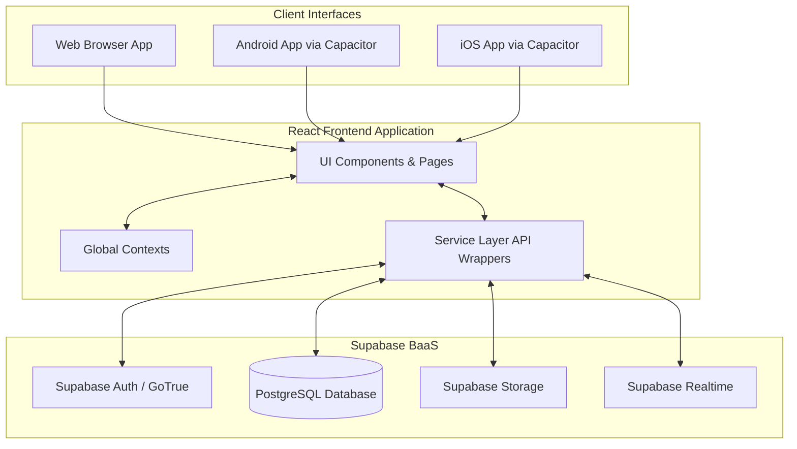
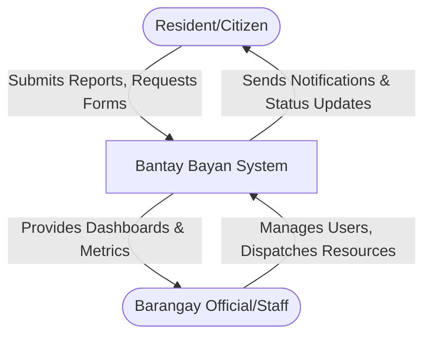
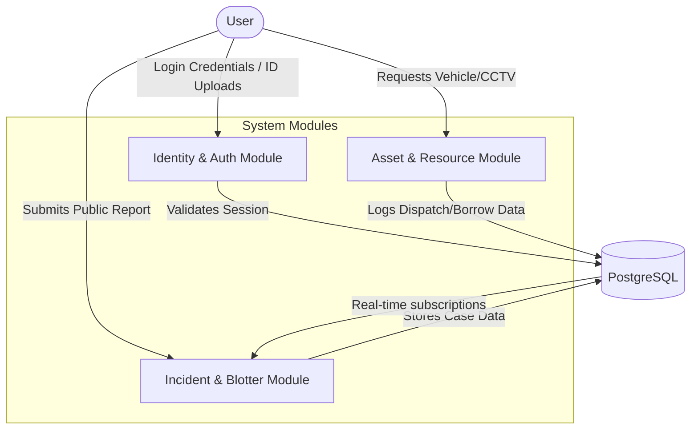
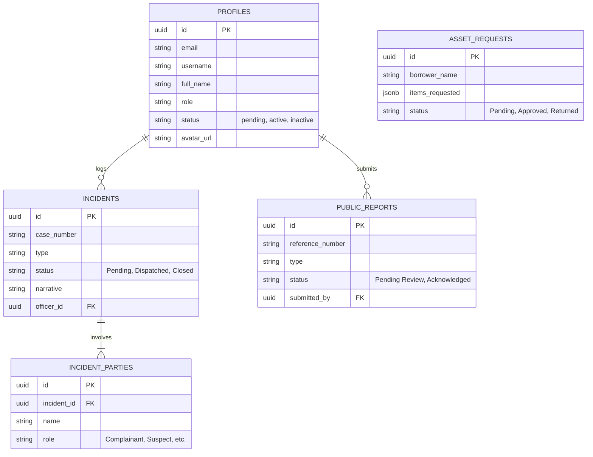
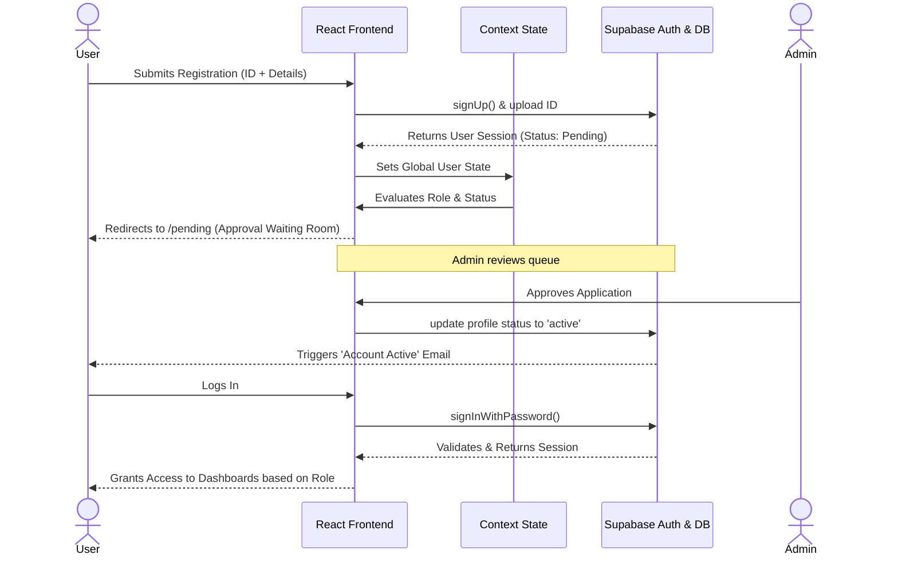

# Bantay Bayan System - Technical Documentation

## 1. Executive Summary
The **Bantay Bayan System** is a comprehensive Barangay Management and Security System tailored to digitize and streamline local government operations. The system facilitates incident reporting, citizen registration, public service requests, asset tracking, and personnel management, securely connecting constituents with barangay officials and security personnel.

---

## 2. Tech Stack Summary
- **Frontend Core**: React 18, TypeScript, Vite
- **Styling**: Tailwind CSS, PostCSS
- **Routing**: React Router v6
- **Backend as a Service (BaaS)**: Supabase 
  - **Database**: PostgreSQL (with Row Level Security)
  - **Auth**: Supabase Auth (with MFA capabilities)
  - **Storage**: Supabase Storage buckets (Avatars, Identity Docs)
- **Mobile Support**: Capacitor JS (for native Android/iOS deployment)
- **Icons & UI Utilities**: Lucide React
- **Document Generation**: jsPDF, xlsx

---

## 3. Project Structure Breakdown

```text
📁 Bantay-Bayan-System/
├── 📁 android/                 # Capacitor generated native Android wrapper
├── 📁 ios/                     # Capacitor generated native iOS wrapper
├── 📁 components/              # Reusable UI components and layouts
│   ├── DashboardLayout.tsx     # Main wrapper for authenticated routes
│   ├── Sidebar.tsx             # Navigation drawer with real-time badges
│   └── PageHeader.tsx          # Consistent header component for pages
├── 📁 contexts/                # React Contexts for global state management
│   ├── AuthContext.tsx         # Session, user profile, and RBAC utilities
│   ├── ThemeContext.tsx        # Dark/Light mode state
│   ├── LanguageContext.tsx     # Internationalization (i18n)
│   └── ToastContext.tsx        # Global notification system
├── 📁 lib/                     # External library configurations
│   └── supabaseClient.ts       # Supabase initialization
├── 📁 pages/                   # Route-level React components (Views)
│   ├── Applications.tsx        # Admin view for pending registrations
│   ├── CommandCenter.tsx       # Main dashboard for active incidents
│   ├── Login.tsx               # Auth flow (Login, Register, Forgot Password)
│   ├── UserManagement.tsx      # Comprehensive personnel & role management
│   └── ...                     # Other feature-specific pages
├── 📁 services/                # API Abstraction layer (Supabase interactions)
│   ├── authService.ts          # Authentication logic
│   ├── incidentService.ts      # Blotter & case management
│   ├── userService.ts          # User profiles & approvals
│   └── resourceService.ts      # Asset tracking & CCTV requests
├── 📄 App.tsx                  # Main router and provider configuration
├── 📄 types.ts                 # Centralized TypeScript interfaces
└── 📄 full_system_schema.sql   # PostgreSQL database schema & RPC functions
```

---

## 4. System Architecture



---

## 5. Data Flow Diagrams

### Level 0: Context Diagram


### Level 1: Core Modules DFD


---

## 6. Database Schema (ER Diagram)



---

## 7. Authentication & Authorization Flow



---

## 8. Module Breakdown

### 🔐 Authentication & Identity (`authService.ts`, `Login.tsx`, `PendingApproval.tsx`)
Handles the complete lifecycle of a user. Integrates Supabase GoTrue for JWT-based auth. Supports Multi-Factor Authentication (MFA), account recovery, and a structured approval workflow where administrators verify resident IDs before granting system access.

### 🧩 Role-Based Access Control (`AuthContext.tsx`, `Sidebar.tsx`)
Defines hierarchical boundaries using context functions (`isSupremeAdmin`, `isHighLevelAdmin`, `canEditRole`). Routes and UI elements are completely encapsulated dynamically based on whether the user is a Citizen, Bantay Bayan, Supervisor, or Barangay Captain.

### 🚨 Incident & Blotter Management (`IncidentForm.tsx`, `CommandCenter.tsx`, `incidentService.ts`)
The core operational module. Enables officers to file blotter reports, log dispatch units, and manage involved parties. Features a "Restricted Persons" flag that warns officers of individuals barred from the premises. 

### 📢 Public Service & Reporting (`PublicReportsQueue.tsx`, `publicReportService.ts`)
Empowers citizens to file non-emergency reports. Administrators review these in a dedicated queue, which can be officially "Acknowledged" or upgraded directly into an official `Incident` case.

### 🚙 Asset & Resource Tracking (`ResourceTracking.tsx`, `resourceService.ts`)
Monitors the borrowing of barangay equipment and the dispatching of patrol vehicles. Maintains a persistent log to ensure high accountability of government property.

---

## 9. Key Features
- **Real-Time Synchronized UI**: The system heavily utilizes Supabase Realtime Channels. Sidebar badges, incident dashboards, and approval queues update automatically across all logged-in devices without polling.
- **Cross-Platform Mobile Readiness**: Structured inside Capacitor, allowing the exact same React codebase to be packaged as a Native Android APK or iOS App.
- **Offline-Resilient Auth**: The application elegantly catches lost database connections and displays a user-friendly fallback state (`System Offline`) rather than crashing.
- **Comprehensive Audit Logging**: Sensitive database actions (inserts, deletes, updates on critical tables) are tracked and displayed in `AuditLogs.tsx` to prevent administrative abuse.
- **Dynamic Theming & Localization**: Native dark mode support using Tailwind and a dedicated Context, alongside a localized language toggle framework.

---

## 10. Suggested Improvements & Scaling Strategies

### Architectural & Scalability
- **Implement Server-Side Rendering (SSR) / Next.js**: Migrating from Vite/React (SPA) to Next.js would drastically improve initial load times and SEO for public-facing forms.
- **Database Indexing**: As the `incidents` and `audit_logs` tables grow, implementing B-Tree indexes on `created_at` and `status` columns in PostgreSQL will be necessary to prevent query degradation.
- **Pagination**: Large lists in `UserManagement.tsx` and `ResolvedCases.tsx` currently load mostly in bulk. Implementing cursor-based pagination will reduce memory overhead.

### Security
- **Stricter Row Level Security (RLS)**: Ensure PostgreSQL RLS policies strictly rely on the `auth.uid()` rather than passing UI-based IDs to RPCs.
- **Edge Functions for Sensitive Logic**: Move the approval logic, email sending logic (currently mocked on the frontend), and role-elevation functions entirely to Supabase Edge Functions to prevent client-side tampering.
- **Rate Limiting**: Apply API rate limiting on the public reporting routes to prevent spam attacks on the database.

### Codebase Structure
- **Component Modularization**: Files like `UserManagement.tsx` (over 1000 lines) and `Login.tsx` (over 700 lines) should be decomposed into smaller, singular components (e.g., `UserTable.tsx`, `RegistrationStepOne.tsx`) to improve maintainability.
- **Query Caching**: Integrate a library like `@tanstack/react-query` to handle caching, background refetching, and stale-data management instead of relying heavily on standard `useEffect` loops.
