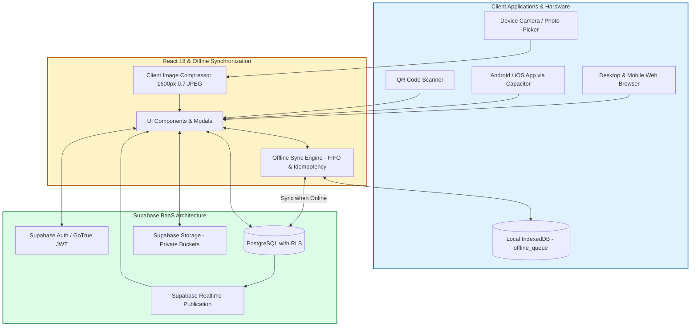

# Bantay Bayan System - Technical Documentation

## 1. Executive Summary
The **Bantay Bayan System** is a comprehensive, enterprise-grade Barangay Management, Security Operations, and Public Assistance platform tailored to digitize, monitor, and streamline local government operations. The system unifies incident blotter recording, resident verification, asset tracking, public service workflows, digital operations logbooks, fleet & patrol monitoring, audit access trails, and offline field operations into a secure, real-time environment.

---

## 2. Tech Stack Summary
- **Frontend Core**: React 18, TypeScript, Vite
- **Styling & Design System**: Tailwind CSS, PostCSS, Lucide React
- **Routing & Navigation**: React Router v6
- **Backend as a Service (BaaS)**: Supabase
  - **Database**: PostgreSQL (with Row Level Security & custom definer functions)
  - **Auth**: Supabase Auth (JWT session lifecycle, MFA capabilities, Role-Based Access Control)
  - **Storage**: Supabase Storage private buckets (`logbook-attachments`, `avatars`, `id-documents`) with RLS and signed URLs
  - **Realtime**: Supabase Realtime Channels (PostgreSQL publication broadcasting)
- **Local Storage & Offline Engine**: Native Browser IndexedDB (`BantayBayanOfflineDB`), Service Workers, Navigator Online API
- **Mobile Hardware & Native Support**: Capacitor JS
  - `@capacitor/camera` (Native photo capture and hardware camera integration)
  - Mobile QR code scanner integration
- **Document & Report Generation**: `jspdf`, `jspdf-autotable`, `xlsx`, `qrcode`

---

## 3. Project Structure Breakdown

```text
📁 Bantay-Bayan-System/
├── 📁 android/                     # Capacitor generated native Android wrapper
├── 📁 ios/                         # Capacitor generated native iOS wrapper
├── 📁 components/                  # Modular and reusable UI components
│   ├── 📁 attachments/             # Photo attachments uploader, compression, & gallery lightbox
│   │   ├── AttachmentGallery.tsx   # Signed URL image strip with zoom modal lightbox
│   │   └── PhotoUploader.tsx       # Dropzone & camera photo picker with 3-photo cap
│   ├── 📁 dashboard/               # Operational dashboards & widgets
│   │   └── DailySummaryWidget.tsx  # Live daily counter and pending items widget
│   ├── 📁 logbook/                 # Operations Logbook components
│   │   ├── AddCorrectionModal.tsx  # Append-only immutable correction dialog
│   │   ├── AddLogbookModal.tsx     # Manual ledger entry modal with photo upload
│   │   ├── CreateHandoverModal.tsx # Shift turn-over creator dialog
│   │   ├── AcknowledgeHandoverModal.tsx # Shift acceptance & signature modal
│   │   ├── ExportLogbookModal.tsx  # PDF / Excel export and print sheet
│   │   ├── LogbookEntryCard.tsx    # Chronological timeline card with offline badges
│   │   └── ShiftHandoverSection.tsx# Shift handover history & acknowledgment tab
│   ├── 📁 offline/                 # Offline status and queue management
│   │   ├── SyncStatusBadge.tsx     # Live status indicator (Online/Offline/Syncing/Issue)
│   │   └── SyncQueueModal.tsx      # Local queue inspector, retry & conflict resolver
│   ├── 📁 reminders/               # Operational alerts & threshold configuration
│   │   ├── AlertSettingsPanel.tsx  # Configurable threshold editor (CCTV, Fleet, Blotter)
│   │   └── OperationalRemindersBanner.tsx # Dynamic urgency banner on Command Center
│   ├── 📁 search/                  # Multi-module global search
│   │   └── GlobalSearchModal.tsx   # Ctrl+K modal searching Blotters, Logbook, CCTV, Fleet
│   ├── 📁 vehicles/                # Vehicle Fleet & Patrol components
│   │   ├── EndTripModal.tsx        # Post-trip check-in, odometer & return photo modal
│   │   ├── StartTripModal.tsx      # Dispatch vehicle modal with passengers & pre-trip photos
│   │   ├── StopActionModal.tsx     # Destination waypoint arrival/departure stamp modal
│   │   ├── VehicleCard.tsx         # Fleet grid card with live status and active trip
│   │   ├── VehicleQRModal.tsx      # Printable QR vehicle pass sheet generator
│   │   └── VehicleScannerModal.tsx # Camera & file-based QR code scanner
│   ├── DashboardLayout.tsx         # Main responsive layout with top status badge & search
│   ├── Sidebar.tsx                 # Navigation drawer with realtime badge counters
│   └── PageHeader.tsx              # Standardized header component
├── 📁 contexts/                    # Global state management
│   ├── AuthContext.tsx             # User session, profile, and role verification
│   ├── LanguageContext.tsx         # Internationalization (English / Filipino)
│   ├── ThemeContext.tsx            # Dark / Light theme toggle
│   └── ToastContext.tsx            # Reactive banner notification context
├── 📁 pages/                       # Application Views (Routes)
│   ├── 📁 vehicles/                # Vehicle Monitor dashboard
│   │   └── VehicleMonitor.tsx      # Live fleet status, trip history, waypoints & QR tools
│   ├── Applications.tsx            # Resident registration review queue
│   ├── AuditLogs.tsx               # Database-level mutation audit records
│   ├── AuditTrail.tsx              # Sensitive record access audit trail (viewed/exported)
│   ├── CCTVRequestForm.tsx         # CCTV footage request log and status tracker
│   ├── CommandCenter.tsx           # Incident overview, reminders banner & daily summary
│   ├── DownloadForms.tsx           # Printable government template documents
│   ├── IncidentForm.tsx            # Official blotter case creation
│   ├── LandingPage.tsx             # Public landing portal
│   ├── Logbook.tsx                 # Digital operations ledger and shift turn-overs
│   ├── Login.tsx                   # Authentication, registration & recovery
│   ├── PublicReportsQueue.tsx      # Citizen incident report intake
│   ├── PublicServiceRequest.tsx    # Citizen form submission portal
│   ├── ResidentDirectory.tsx       # Verified resident ledger
│   ├── ResolvedCases.tsx           # Historical resolved case archives
│   ├── ResourceTracking.tsx        # Equipment borrowing & inventory monitoring
│   ├── Settings.tsx                # Visual branding, leadership & alert threshold configuration
│   └── UserManagement.tsx          # Personnel duty status & role elevation
├── 📁 services/                    # API & Service Layer
│   ├── 📁 offline/                 # Offline Storage & Synchronization Engine
│   │   ├── offlineDb.ts            # IndexedDB manager (`BantayBayanOfflineDB`)
│   │   ├── offlineSyncService.ts   # FIFO orchestrator, idempotency & conflict detection
│   │   └── offlineTypes.ts         # Queue item interfaces and status types
│   ├── attachmentService.ts        # Storage bucket upload, signed URL generator, deletion
│   ├── auditAccessService.ts       # Access audit logging (view, export, print)
│   ├── authService.ts              # Authentication & password management
│   ├── incidentService.ts          # Incident case reporting & dispatch
│   ├── logbookExportService.ts     # PDF / Excel rendering engine for logbook records
│   ├── logbookService.ts           # Logbook ledger querying, RPC logging & corrections
│   ├── reminderService.ts          # Operational threshold reminders & settings API
│   ├── searchService.ts            # Global multi-entity database search API
│   ├── shiftHandoverService.ts     # Shift turn-over persistence & acknowledgment API
│   ├── summaryService.ts           # Daily counters and pending statistics aggregator
│   ├── userService.ts              # Profile and personnel management
│   └── vehicleService.ts           # Fleet state, live trip dispatch, waypoints & QR
├── 📁 src/config/                  # Global Configuration
│   ├── branding.ts                 # Dynamic seals, logo URLs, municipality branding
│   └── features.ts                 # Centralized feature flags
├── 📁 supabase/migrations/         # Idempotent database migrations and rollback scripts
│   ├── 20261007_create_logbook_core.sql & rollback
│   ├── 20261007_auto_log_triggers.sql & rollback
│   ├── 20261007_create_vehicle_trip_monitoring.sql & rollback
│   ├── 20261007_create_logbook_extras.sql & rollback
│   ├── 20261007_create_audit_access_log.sql & rollback
│   ├── 20261008_create_search_summary_reminders.sql & rollback
│   ├── 20261008_create_vehicle_qr_codes.sql & rollback
│   ├── 20261008_create_log_attachments.sql & rollback
│   └── 20261008_create_offline_queue_support.sql & rollback
├── 📁 utils/                       # Utility functions
│   ├── imageCompressor.ts          # Client-side canvas image downscaling & JPEG compression
│   └── photoPicker.ts              # Unified Capacitor camera / HTML file input picker
├── 📄 App.tsx                      # Root route registry, layout bindings & auth guards
└── 📄 types.ts                     # Central TypeScript data interfaces
```

---

## 4. System Architecture


```mermaid
graph TD
    subgraph ClientLayer [Client Applications & Hardware]
        Web[Desktop & Mobile Web Browser]
        MobileApp[Android / iOS App via Capacitor]
        Camera[Device Camera / Photo Picker]
        QRScanner[QR Code Scanner]
        IndexedDB[(Local IndexedDB - offline_queue)]
    end

    subgraph FrontendEngine [React 18 & Offline Synchronization]
        UI[UI Components & Modals]
        OfflineSync[Offline Sync Engine - FIFO & Idempotency]
        ImageCompressor[Client Image Compressor 1600px 0.7 JPEG]
        
        Web --> UI
        MobileApp --> UI
        Camera --> ImageCompressor --> UI
        QRScanner --> UI
        UI <--> OfflineSync <--> IndexedDB
    end

    subgraph BackendSupabase [Supabase BaaS Architecture]
        Auth[Supabase Auth / GoTrue JWT]
        PostgreSQL[(PostgreSQL with RLS)]
        Storage[Supabase Storage - Private Buckets]
        Realtime[Supabase Realtime Publication]
        
        OfflineSync <-->|Sync when Online| PostgreSQL
        UI <--> Auth
        UI <--> PostgreSQL
        UI <--> Storage
        PostgreSQL --> Realtime --> UI
    end

    classDef client fill:#e0f2fe,stroke:#0369a1,stroke-width:2px;
    classDef frontend fill:#fef3c7,stroke:#b45309,stroke-width:2px;
    classDef backend fill:#dcfce7,stroke:#15803d,stroke-width:2px;

    class ClientLayer client;
    class FrontendEngine frontend;
    class BackendSupabase backend;
```

---

## 5. Database Schema & Tables

### 1. `public.logbook_entries`
Immutable digital operations ledger recording all operational activities and system events.
- `id` (UUID, PK)
- `created_at` (TIMESTAMPTZ, Default: `now()`)
- `client_timestamp` (TIMESTAMPTZ, Default: `now()`) — Original device time when logged
- `idempotency_key` (TEXT, UNIQUE) — Client UUID to prevent duplicate insertions
- `reported_by` (UUID, FK -> `profiles.id`)
- `reporter_name` (TEXT) — Snapshot of reporter's name at time of logging
- `reporter_role` (TEXT) — Snapshot of reporter's role
- `category` (ENUM: `blotter`, `incident`, `cctv_request`, `vehicle`, `asset`, `queue`, `handover`, `correction`, `other`)
- `action` (TEXT) — Specific action verb (`trip_started`, `MANUAL_ENTRY`, `case_created`, etc.)
- `title` (TEXT) — Subject or headline
- `description` (TEXT) — Comprehensive narrative
- `reference_type` (TEXT) — Foreign module indicator (`vehicle_trip`, `incident`, etc.)
- `reference_id` (TEXT) — Foreign entity ID
- `metadata` (JSONB) — Structured attributes, offline flags, location coordinates
- `corrects_entry_id` (UUID, FK -> `logbook_entries.id`) — Self-reference for immutable amendments

### 2. `public.vehicles`
Barangay fleet registry.
- `id` (UUID, PK)
- `name` (TEXT, UNIQUE) — Vehicle label (e.g. *Transformative #1*, *Ambulance*)
- `plate_number` (TEXT) — Plate or conduction sticker number
- `type` (TEXT) — Vehicle classification
- `status` (TEXT: `available`, `on_trip`, `maintenance`, `decommissioned`)
- `qr_code_token` (TEXT) — Signed opaque reference token for QR vehicle passes
- `created_at` (TIMESTAMPTZ)

### 3. `public.vehicle_trips`
Active and historical patrol missions and dispatches.
- `id` (UUID, PK)
- `vehicle_id` (UUID, FK -> `vehicles.id`)
- `driver_id` (UUID, FK -> `profiles.id`, Optional)
- `driver_name` (TEXT) — Assigned driver name
- `purpose` (TEXT) — Mission description
- `status` (TEXT: `planned`, `ongoing`, `completed`, `cancelled`)
- `odometer_start` (NUMERIC), `odometer_end` (NUMERIC)
- `remarks` (TEXT)
- `logged_by` (UUID, FK -> `profiles.id`)
- `started_at` (TIMESTAMPTZ), `completed_at` (TIMESTAMPTZ)
- `client_timestamp` (TIMESTAMPTZ), `idempotency_key` (TEXT, UNIQUE)

### 4. `public.trip_passengers` & `public.trip_stops`
- `trip_passengers`: (`id`, `trip_id`, `person_id`, `passenger_name`, `created_at`)
- `trip_stops`: (`id`, `trip_id`, `place`, `arrival_time`, `departure_time`, `manual_time_reason`, `client_timestamp`, `idempotency_key`)

### 5. `public.shift_handovers`
Structured post turn-overs between outgoing and incoming duty officers.
- `id` (UUID, PK)
- `outgoing_user` (UUID, FK -> `auth.users.id`), `outgoing_name` (TEXT)
- `incoming_user` (UUID, FK -> `auth.users.id`), `incoming_name` (TEXT)
- `shift_name` (TEXT) — Shift identifier (Morning, Afternoon, Night)
- `notes` (TEXT) — General briefing summary
- `pending_items` (TEXT) — Endorsement items
- `created_at` (TIMESTAMPTZ), `client_timestamp` (TIMESTAMPTZ)
- `acknowledged_at` (TIMESTAMPTZ), `acknowledged_by` (UUID), `acknowledged_by_name` (TEXT)
- `idempotency_key` (TEXT, UNIQUE)

### 6. `public.audit_access_logs`
Access logging for viewing, exporting, or printing confidential records.
- `id` (UUID, PK)
- `user_id` (UUID, FK -> `auth.users.id`), `user_name` (TEXT), `user_email` (TEXT), `user_role` (TEXT)
- `action` (TEXT: `viewed`, `exported`, `printed`)
- `record_type` (TEXT: `logbook`, `blotter`, `cctv_request`, `resident`)
- `record_id` (TEXT)
- `user_agent` (TEXT), `timestamp` (TIMESTAMPTZ)

### 7. `public.system_alert_settings`
Configurable operational thresholds for reminders.
- `id` (UUID, PK)
- `key` (TEXT, UNIQUE) — e.g. `cctv_retention_days`, `trip_duration_hours`, `blotter_stale_days`
- `label` (TEXT), `value_numeric` (NUMERIC), `unit` (TEXT), `description` (TEXT)

### 8. `public.log_attachments`
Private photo attachments linked to logbook records and vehicle dispatches.
- `id` (UUID, PK)
- `entry_id` (UUID, FK -> `logbook_entries.id`, Optional)
- `trip_id` (UUID, FK -> `vehicle_trips.id`, Optional)
- `storage_path` (TEXT) — Path in private Supabase bucket `logbook-attachments`
- `file_name` (TEXT), `file_size` (BIGINT), `mime_type` (TEXT)
- `uploaded_by` (UUID, FK -> `auth.users.id`)
- `created_at` (TIMESTAMPTZ)

---

## 6. Automated Triggers & Stored Functions

| Trigger / Function | Target Entity | Execution Timing | Purpose |
| :--- | :--- | :--- | :--- |
| `public.log_event(...)` | Stored RPC Function | On-Demand | Server-side security definer function creating immutable logbook entries with snapshot credentials, `client_timestamp`, and idempotency duplicate checking. |
| `trg_log_blotter_event` | `incidents` | `AFTER INSERT OR UPDATE` | Automatically records new blotter cases, status updates, and resolutions into the logbook. |
| `trg_log_cctv_event` | `cctv_requests` | `AFTER INSERT` | Automatically records new CCTV footage inspection requests into the logbook. |
| `trg_log_asset_event` | `asset_requests` | `AFTER INSERT OR UPDATE` | Automatically records equipment releases, borrowings, and returns. |
| `trg_log_public_report_event` | `public_reports` | `AFTER INSERT OR UPDATE` | Automatically records citizen reports and incident conversions into the logbook. |
| `trg_vehicle_trip_lifecycle` | `vehicle_trips` | `AFTER INSERT OR UPDATE OF status` | Syncs `vehicles.status` (`available` ↔ `on_trip`) and generates logbook entries for trip dispatch and mission completion. |
| `trg_trip_stop_log` | `trip_stops` | `AFTER INSERT OR UPDATE` | Auto-logs arrival and departure waypoint timestamps into the logbook. |
| `trg_log_shift_handover_event` | `shift_handovers` | `AFTER INSERT OR UPDATE` | Auto-logs shift handovers when created and acknowledged. |
| `trg_log_attachment_uploaded` | `log_attachments` | `AFTER INSERT` | Auto-logs attachment upload references into the logbook without storing binary payload. |
| `public.get_daily_operational_summary()` | Stored RPC Function | On-Demand | Aggregates today's counts and unresolved items for the Daily Summary Widget. |

---

## 7. Subsystems & Key Features

### 1. Operations Logbook (`/logbook`)
- **Immutability Principle**: Logbook entries can never be updated or deleted. Database RLS explicitly denies `UPDATE` and `DELETE` queries.
- **Append-Only Corrections**: Adjustments are recorded as formal correction entries linking back to `corrects_entry_id`.
- **Chronological Grouping**: Entries are grouped by local hour intervals (`14:00 - 14:59`) with category indicators.
- **Export & Print**: Custom PDF generation with official city seals, headers, and Excel `.xlsx` workbook generation.

### 2. Vehicle Fleet & Patrol Monitor (`/vehicles`)
- **Real-Time Fleet Grid**: Live vehicle cards showing active driver, mission purpose, and elapsed trip time.
- **Waypoint & Odometer Tracking**: Support for sequential waypoint check-ins with manual override logging.
- **Vehicle QR Codes**: Printable official vehicle pass sheets containing plate number, vehicle model, barangay header, and deep-linkable QR codes.
- **Capacitor QR Scanner**: Instant dispatch lookup via mobile camera scanner or image upload.

### 3. Photo Attachments
- **Client-Side Compression**: High-resolution mobile photos (12MP+) are downscaled to 1600px width at 0.7 JPEG quality before transmission.
- **Private Storage Bucket**: `logbook-attachments` storage bucket configured with strict RLS allowing authenticated staff only.
- **Signed URLs**: Media is accessed via time-limited pre-signed URLs generated on-demand.
- **Non-Blocking Upload**: Image uploads run asynchronously in the background and never delay saving main entries.

### 4. Offline Queue & Sync Engine (`services/offline/`)
- **Native IndexedDB Store**: Local persistent mutation store (`BantayBayanOfflineDB`).
- **Sequential FIFO Ordering**: Preserves execution sequence per trip (`Start` ➔ `Arrival` ➔ `Departure` ➔ `End`).
- **Original Device Time**: Preserves `client_timestamp` alongside server `created_at` with an `Entered Offline` badge.
- **Duplicate Prevention**: UUID idempotency keys ensure no duplicate entries occur during network retries.
- **Conflict Handling**: Server constraint violations (e.g. vehicle already on an active trip) mark items as `conflict` and retain them in the local queue inspector for manual resolution without data loss.
- **Responsive Status Indicator**: `<SyncStatusBadge />` dynamically displays connection and queue status in the navigation bar.

---

## 8. Operational & Regression Verification

### Build & Typecheck Verification
```bash
npm run build
```
- TypeScript compiler (`tsc --noEmit`) and Vite production bundle pass with **0 errors**.

### Rollback Procedures
All schema migrations are matched with idempotent rollback scripts in `supabase/migrations/`:
1. `20261007_create_logbook_core_rollback.sql`
2. `20261007_auto_log_triggers_rollback.sql`
3. `20261007_create_vehicle_trip_monitoring_rollback.sql`
4. `20261007_create_logbook_extras_rollback.sql`
5. `20261007_create_audit_access_log_rollback.sql`
6. `20261008_create_search_summary_reminders_rollback.sql`
7. `20261008_create_vehicle_qr_codes_rollback.sql`
8. `20261008_create_log_attachments_rollback.sql`
9. `20261008_create_offline_queue_support_rollback.sql`
